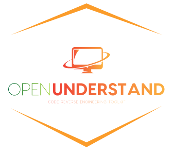

# IUST-OpenUnderstand-Project
This repository is being created for the development of the OpenUnderstand project as the final project of the compiler course at Iran University of Science and Technology (Winter-Spring 2022).  The main references as the task of our team JavaModify and JavaUseModule will be implemented in 3 steps.

# What is OpenUnderstand?

An open-source implementation of Understand API in Python.

* OpenUnderstand Documentation Website: [www.m-zakeri.github.io/OpenUnderstand.](https://m-zakeri.github.io/OpenUnderstand/)

# Installation
All dependencies are listed in `requrments.txt` and in order to run you just can click `atuorun.bat` for creating `venv` as _virtual environment_ and installing all requirements.

    @echo off
    py -m pip install --upgrade pip
    py -m pip install --user virtualenv
    py -m venv env
    CALL .\env\Scripts\activate.bat
    pip install -r requirements.txt
    pause

